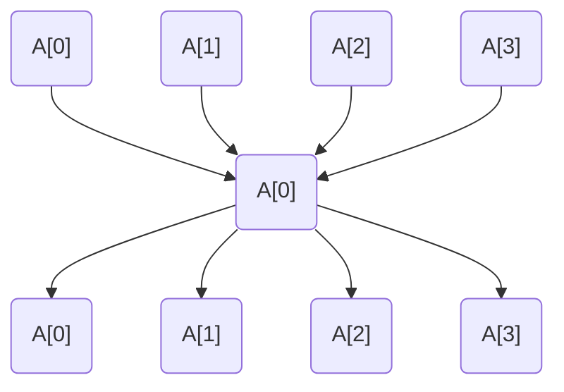

# [3.2] - Distributed training

## Introduction

Welcome to the exciting world of distributed GPU training using PyTorch!

Training deep learning models can be a computationally intensive task, often requiring substantial time and computational resources. However, distributed GPU training provides a solution to this challenge. By leveraging multiple GPUs, either on a single machine or across a network of machines, the training process can be significantly accelerated.

PyTorch, an open-source machine learning library, is one of the leading tools used for distributed training. Its torch.distributed package offers robust support for distributed computing, enabling users to efficiently harness the power of multiple GPUs.

In distributed GPU training, a model's computations are spread across multiple GPUs. Data parallelism is a common technique used in this process, which involves dividing the input data into chunks and processing each chunk on a different GPU in parallel. The computed gradients from each GPU are then synchronized to update the model parameters.

Distributed GPU training is a valuable skill in the modern era of machine learning and deep learning. Mastering it with PyTorch will unlock new levels of computational power and efficiency for your models, enabling you to tackle larger and more complex problems.

## Content & Learning Objectives

### 1. Basics of distributed programming

Learning objectives:
* Learn the structure of the PyTorch distributed class
* Understand what a process, thread, and rank is
* Explore what might cause race conditions

### 2. Data parallelism

Learning objectives:
* Learn about common collective operations
* Implement broadcast, reduce, and all-reduce
* Consider the effects of different connection topologies

### 3. Pipeline parallelism, DDP

Learning objectives:
* TODO

### 4. Bonus
Includes some suggested bonus exercises and further reading.


## Setup

```python3
# %%
import torch
from torch import distributed as dist
from torch.distributed import ReduceOp
from typing import List
```

<!-------------------------------------------------->

# Distributed programming in PyTorch

The PyTorch distributed module, officially known as `torch.distributed`, is a part of the PyTorch library designed to support distributed computing. This module provides the tools and capabilities necessary for the use of multiple computing resources, such as multiple GPUs across multiple nodes, in order to speed up training times and manage larger models and datasets.

The PyTorch distributed module also integrates well with other PyTorch modules and APIs, making it a powerful tool for distributed machine learning tasks. It's designed to be flexible, efficient, and straightforward to use, facilitating scalable and efficient distributed training with PyTorch.

Here, we have also provided a fake distributed class that implements much of the functionality of `torch.distributed` but simulates multiple GPUs using threads. You can explore the implementation as time permits in `test.py`.

## Processes, threads, and ranks

In the context of distributed programming, understanding the difference between processes and threads as well as the concept of ranks for PyTorch distributed GPU programming is essential.

### Processes
A process can be thought of as an instance of a computer program that is being executed. It has its own memory space and is managed independently by the operating system. In PyTorch distributed programming, each process is typically associated with a single computational resource, such as a CPU core or a GPU. Each process can execute its code independently, and they typically communicate with each other using inter-process communication mechanisms, such as sending and receiving messages.

### Threads
Threads are the smallest units of execution within a process. All threads within a process share the same memory space, which allows them to read from and write to the same variables and data structures, facilitating easy communication between threads. However, this shared memory space can lead to issues such as race conditions, which must be managed using locks, semaphores, or other synchronization techniques. In PyTorch, computations on the tensors are multithreaded by default, meaning that operations can use multiple CPU cores for improved performance.

### Ranks
In PyTorch's distributed package, a "rank" is a unique identifier given to each process involved in the distributed computation. This is how one process refers to another when they need to communicate or coordinate in some way. The process with rank 0 is typically considered the "master" process and is often used to coordinate the actions of the other "worker" processes. However, all processes can communicate with each other directly, so this is more of a convention than a strict hierarchy. Rank assignment is generally determined by the order in which the processes are launched. In both `torch.distributed` and our fake distributed class, note that you can access the current rank for an instance `dist` using `dist.get_rank()` which returns an integer from `0` to `world_size-1` where `world_size` is the number of GPUs, threads, or other devices based on the distributed class being used.

These concepts provide the foundation for distributed computing in PyTorch, where multiple processes, each potentially running on different computational resources and containing multiple threads, can work together to perform computations on large datasets or complex models.

## Comparing `nccl` and alternatives

`gloo`: Gloo, developed by Facebook, is a library that is equipped to support both CPU and GPU operations. However, its GPU function significantly trails in speed compared to NVIDIA's NCCL. A key merit of Gloo is its superior error message system, making it useful for debugging before transitioning to NCCL.

`nccl`: On the other hand, NCCL (pronounced 'nickel') is the brainchild of NVIDIA. It is exclusively tailored for NVIDIA GPUs, demonstrating the high level of optimization and specialization for NVIDIA's GPU and products like NVLink and NVSwitch.

`mpi`: Meanwhile, MPI, an abbreviation for Message Passing Interface, is not a specific library but an open standard dating back to the 90s. Unlike Gloo and NCCL, MPI is primarily designed for clusters with thousands of CPUs. It won't be applicable in our present context.

## Race conditions

A race condition, in the context of distributed GPU training, is a situation where multiple computing processes or threads are attempting to access and manipulate shared data simultaneously, and the outcome depends on the relative timing of these operations.

For example, imagine two or more GPUs updating a shared model parameter at the same time. If GPU 1 reads the parameter's value, GPU 2 also reads the same value, and then both GPUs perform calculations and attempt to write the result back to the shared parameter memory, a race condition may occur. This is because the value written by the first GPU to finish its calculations could be immediately overwritten by the second GPU, leading to data inconsistency and possibly incorrect results.

To avoid such race conditions, strategies such as locking or synchronization barriers can be used. These strategies ensure that only one process can modify a given memory location at a time.

### Exercise: Test simulated race conditions on multiple threads

* Difficulty: 1/5
* Importance: 3/5

Read the code below, which creates functions to add to and subtract from a shared variable multiple times on two different threads, printing the result to the console. Consider how multiple threads accessing the global `value` variable might affect the output. Will this output be deterministic? Run the code to verify your predictions and feel free to adjust values or add delays to explore how this changes the results.

```python
from threading import Thread

# Add to the global variable
def adder(amount, repeats):
    global value
    for _ in range(repeats):
        value += amount
 
# Subtract from the global variable
def subtractor(amount, repeats):
    global value
    for _ in range(repeats):
        value -= amount
        
def add_and_subtract():
    # Start a thread making additions
    adder_thread = Thread(target=adder, args=(1, 1000000))
    adder_thread.start()
    # Start a thread making subtractions
    subtractor_thread = Thread(target=subtractor, args=(1, 1000000))
    subtractor_thread.start()
    # Wait for both threads to finish
    print('Waiting for threads to finish...')
    adder_thread.join()
    subtractor_thread.join()
    # Print the value
    print(f'Value: {value}')

if __name__ == '__main__':
    value = 0
    add_and_subtract()
```

<!-------------------------------------------------->

# Data parallelism

Data parallelism is our focus today. While it's not the most efficient method, it's relatively straightforward to grasp and implement, and can be further optimized or combined with other approaches for better performance.

Data parallelism works with N identical GPUs:

* We initialize by copying the same weights to each GPU.
* Then, we divide a batch of size B into N "minibatches", each of size M=B//N. For simplicity, let's assume N evenly divides B.
* Every GPU executes a forward and backward pass on its respective minibatch to calculate the local gradients.
* Lastly, the gradients are synchronized across all GPUs with "all-reduce."

"All-reduce" signifies that each GPU exchanges minibatch gradients until all devices possess the same sum. The summed gradients are equivalent to those obtained from a single forward pass on the full batch B, with certain exceptions for batch normalization and dropout layers.

Batch normalization poses a unique challenge because it normally computes a mean over the full batch, but in this case, each device computes a mean over its minibatch. To replicate dropout across all devices, the random number generator on each device needs careful initialization.

Assuming all special cases are addressed and all GPUs hold an identical sum of gradients, each GPU can independently execute an identical optimizer step, deterministically modifying the parameters to produce the same result. This concludes a single iteration, keeping all the devices synchronized.

### Advantages of Data Parallelism
The primary advantage is that any model that fits on a single GPU can be adapted to a data parallel version without substantial modifications. As the batch elements are independent (except for batch normalization), devices only need to communicate once per batch to sum their gradients.

In contrast, tensor parallelism and pipeline parallelism necessitate sending activations during both forward and backward passes, requiring clever strategies to reduce the amount of communication.

### Disadvantages of Data Parallelism
One downside is that the communication between GPUs can become overwhelmed, as all GPUs aim to transmit data simultaneously while summing gradients. This issue can be partially mitigated by sending gradients of the later layers as soon as they're calculated, alternating with computing gradients of the earlier layers, and also by utilizing fast interconnects like NVLink.

If a model can't run on a single GPU even with a minibatch size of 1, data parallelism alone isn't viable; instead, one of the other two methods, potentially in combination with data parallelism, must be employed.

From a memory standpoint, data parallelism is inefficient as it duplicates all parameters N times, along with the optimizer state. This duplication can be lessened by distributing the optimizer state across devices, albeit at the cost of increased communication.

As N increases, the minibatch size B/N becomes too small to fully utilize the GPU. While one can increase the total batch size B to compensate, large batches tend to have worse generalization, setting a problem-dependent limit to B's increase.

## Collective operations

Now, we will read about a few common operations for transferring and synchronizing data across multiple threads or GPUs, often known as collective operations.

* Broadcast: In a broadcast operation, data from one device (commonly known as the root device) is distributed to all other devices in a distributed system. This operation ensures that all participating devices share the same copy of the data, starting from one source. In the context of GPUs, this could mean sending a copy of a model's parameters from one GPU to all other GPUs in a multi-GPU system.

* Reduce: A reduce operation involves taking an array of input data from all devices in a distributed system and reducing it to a single result using a specified operation (such as addition, multiplication, finding the maximum, etc.). This operation is performed in a parallel manner across all devices. The result is then stored on a designated device, often called the root device. For instance, a reduce operation on GPUs might involve collecting gradients calculated on each GPU and summing them up to get the final gradient update value.

* All-Reduce: All-reduce is a combination of the reduce and broadcast operations. It first performs a reduction operation using a specified operation (such as addition or finding the maximum) on data from all devices. The resulting value is then broadcast to all devices in the system. This ensures that every device in the distributed system holds the identical result of the reduction. An all-reduce operation is commonly used in multi-GPU systems to ensure all GPUs have the same updated model parameters after performing their individual gradient updates.

You can read more about these operations, as well as other popular collective operations (gather, all-gather, etc.) with diagrams in [NCCL documentation](https://docs.nvidia.com/deeplearning/nccl/user-guide/docs/usage/operations.html) as well as [Wikipedia](https://en.wikipedia.org/wiki/Collective_operation).

## Implementing collective operations

Here, we will implement broadcast, reduce, and all-reduce using multiple topologies to explore the efficiency of different implementations.

### Exercise: Broadcast

* Difficulty: 2/5
* Importance: 3/5

First, let's consider various implementations of broadcast, which transfers data from one rank to all other ranks.
1. Implement broadcast using a naive (one-to-all) topology
2. Implement broadcast using a tree (binary split) topology
3. Implement broadcast using a ring (passing to an adjacent rank) topology

Which topology do you expect would be faster in most settings? Consider pros and cons of this approach.

```python
from test import test_broadcast_naive

def broadcast_naive(tensor: torch.Tensor, src: int):
    # SOLUTION
    if dist.get_rank() == src:
        for i in range(dist.get_world_size()):
            if i != dist.get_rank():
                dist.send(tensor, i)
    else:
        dist.recv(tensor, src)


if __name__ == '__main__':
    test_broadcast_naive(broadcast_naive)
#%%
from test import test_broadcast_tree

def broadcast_tree(tensor: torch.Tensor, src: int):
    # SOLUTION
    curr_mult = 1
    rank_shifted = lambda: (dist.get_rank() - src) % dist.get_world_size()
    while curr_mult * 2 <= dist.get_world_size():
        if rank_shifted() < curr_mult:
            dist.send(tensor, (dist.get_rank() + curr_mult) % dist.get_world_size())
        elif rank_shifted() < curr_mult * 2:
            dist.recv(tensor, (dist.get_rank() - curr_mult) % dist.get_world_size())
        curr_mult *= 2
        dist.barrier()

if __name__ == '__main__':
    test_broadcast_tree(broadcast_tree)

#%%
from test import test_broadcast_ring

def broadcast_ring(tensor: torch.Tensor, src: int):
    # SOLUTION
    to_shifted = lambda i: (i - src) % dist.get_world_size()
    to_orig = lambda i: (i + src) % dist.get_world_size()
    for i in range(1, dist.get_world_size()):
        if to_shifted(dist.get_rank()) == i-1:
            dist.send(tensor, to_orig(i))
        elif to_shifted(dist.get_rank()) == i:
            dist.recv(tensor, to_orig(i-1))
        dist.barrier()

if __name__ == '__main__':
    test_broadcast_ring(broadcast_ring)
```

### Exercise: Reduce

* Difficulty: 3/5
* Importance: 2/5

Next, implement the reduce operation to move data from all devices to one device, supporting the following operations based on the input parameter:
* Addition, denoted by `op=ReduceOp.SUM`
* Multiplication, denoted by `op=ReduceOp.PRODUCT`
* Maximum, denoted by `op=ReduceOp.MAX`
* Minimum, denoted by `op=ReduceOp.MIN`

and the following topologies:
1. Implement reduce using a naive (all-to-one) topology
2. Implement reduce using a tree (binary join) topology

Which topology do you expect would be faster in most settings? Consider pros and cons of this approach.

```python
from test import test_reduce_naive

def reduce_naive(tensor: torch.Tensor, dst: int, op=ReduceOp.SUM):
    # SOLUTION
    if dist.get_rank() == dst:
        for i in range(dist.get_world_size()):
            if i != dist.get_rank():
                buff = torch.empty_like(tensor)
                dist.recv(buff, i)
                dist.barrier()
                if op == ReduceOp.SUM:
                    tensor += buff
                elif op == ReduceOp.PRODUCT:
                    tensor *= buff
                elif op == ReduceOp.MAX:
                    tensor = torch.max(tensor, buff)
                elif op == ReduceOp.MIN:
                    tensor = torch.min(tensor, buff)
                else:
                    raise NotImplementedError(f'op {op} not implemented')
    else:
        for i in range(dist.get_world_size()):
            if i == dist.get_rank():
                dist.send(tensor, dst)
            elif i == dst:
                continue
            dist.barrier()
    dist.barrier()

if __name__ == '__main__':
    test_reduce_naive(reduce_naive)

# %%
from test import test_reduce_tree

def reduce_tree(tensor: torch.Tensor, dst: int, op=ReduceOp.SUM):
    # SOLUTION
    curr_mult = dist.get_world_size() / 2
    rank_shifted = lambda: (dist.get_rank() - dst) % dist.get_world_size()
    while curr_mult >= 1:
        if rank_shifted() < curr_mult:
            buff = torch.empty_like(tensor)
            dist.recv(buff, (dist.get_rank() + curr_mult) % dist.get_world_size())
            if op == ReduceOp.SUM:
                tensor += buff
            elif op == ReduceOp.PRODUCT:
                tensor *= buff
            elif op == ReduceOp.MAX:
                tensor = torch.max(tensor, buff)
            elif op == ReduceOp.MIN:
                tensor = torch.min(tensor, buff)
            else:
                raise NotImplementedError(f'op {op} not implemented')
        elif rank_shifted() < curr_mult * 2:
            dist.send(tensor, (dist.get_rank() - curr_mult) % dist.get_world_size())
        curr_mult /= 2
    dist.barrier()

if __name__ == '__main__':
    test_reduce_tree(reduce_tree)
```

### Exercise: All-reduce

* Difficulty: 2/5
* Importance: 3/5

Finally, implement the all-reduce operation using the following topologies:
1. Implement all-reduce using a naive (all-to-one-to-all) topology
    1. Init tensors in respective processes based on the rank
    2. Send all tensors to rank 0, using dist.barrier to ensure synchronization (reduce step)
    3. Send the result from rank 0 process to all process (scatter step)

2. Implement all-reduce using a butterfly topology as depicted in `(c)` below:


Which topology do you expect would be faster in most settings? Consider the pros and cons of this approach.

Modify the test cases imported here to run the same operation using `dist.all_reduce` and compare the performance for larger tensors of size 1024x1024. You can also try seeing how these methods differ in speed for different tensor sizes. Which one do you expect to perform better, and why? What happens when the world size (as initialized in the test case) is changed?

```python
from test import test_allreduce_naive

def allreduce_naive(tensor: torch.Tensor, op=ReduceOp.SUM):
    # SOLUTION
    reduce_naive(tensor, dst=0, op=op)
    broadcast_naive(tensor, src=0)

if __name__ == '__main__':
    test_allreduce_naive(allreduce_naive)

#%%
from test import test_allreduce_butterfly

def allreduce_butterfly(tensor: torch.Tensor, op=ReduceOp.SUM):
    # SOLUTION
    rank = bin(dist.get_rank())[2:].zfill(len(bin(dist.get_world_size()-1)[2:]))
    buff = torch.empty_like(tensor)
    for i in range(len(rank)):
        partner_rank = rank[:i] + str(1-int(rank[i])) + rank[i+1:]
        partner_rank = int(partner_rank, 2)
        dist.send(tensor.clone(), partner_rank)
        dist.recv(buff, partner_rank)
        if op == ReduceOp.SUM:
            tensor += buff
        elif op == ReduceOp.PRODUCT:
            tensor *= buff
        elif op == ReduceOp.MAX:
            tensor = torch.max(tensor, buff)
        elif op == ReduceOp.MIN:
            tensor = torch.min(tensor, buff)
        else:
            raise NotImplementedError(f'op {op} not implemented')
    dist.barrier()

if __name__ == '__main__':
    test_allreduce_butterfly(allreduce_butterfly)
```

<!-------------------------------------------------->

# Pipeline parallelism

TODO

<!-------------------------------------------------->

# Bonus

### Exercise: Gather and all-gather

* Difficulty: 4/5
* Importance: 2/5

Implement gather and all-gather using naive and tree topologies, based on the description of this function in NCCL documentation linked earlier.